Wanted to write a quick post to share what we’ve been working on. It’s a new **Virtual Receptionist Kiosk application,** which will be available to all Meeting Room 365 subscribers in the next couple of months.

The virtual receptionist can be mounted at the entrance to your office building, and help your visitors find who they’re looking for, let them know their guests have arrived, and (optionally) guide the guests through the process of signing an NDA, which can be incredibly helpful in protecting your company from liability in the event that a guest is visiting.

### Demonstration Video

You can see a demo video below:

### Sign in Flow

When a guest visits your office, they will see a simple welcome message, branded with your custom logo and welcome message.

Once they press “Visitor Sign In”, they will see a short form, which collects basic information about your guests, and allows your guest to send a message to the person they’re visiting.

Optionally, the display connects to your Active Directory to pull a list of users and emails, to notify the correct contact person of their guest’s arrival.

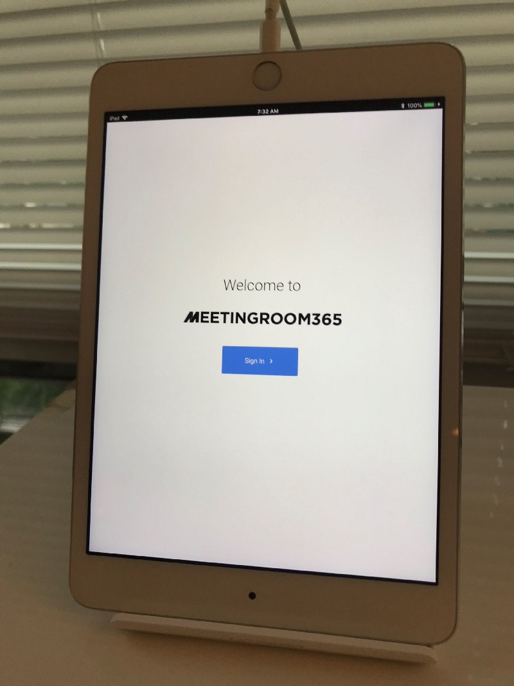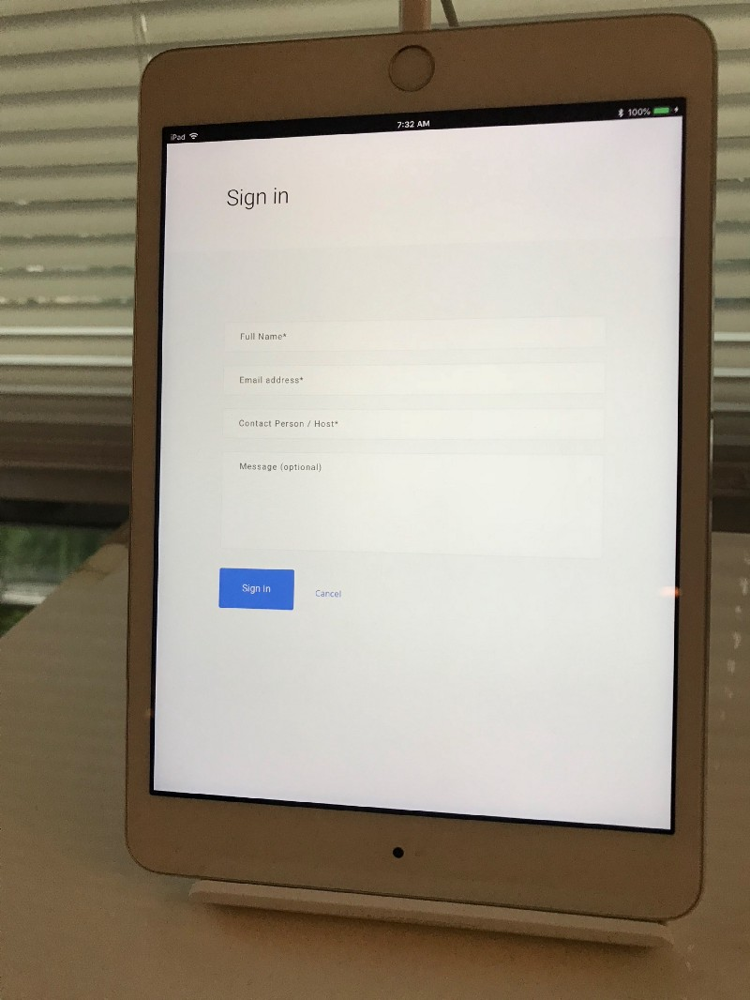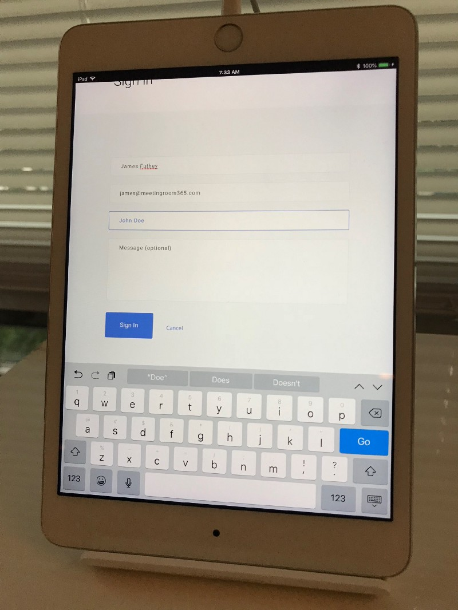

### NDA Presentation

We support custom Non-Disclosure Agreements, which you can upload and edit from the admin portal in either HTML or Markdown format. We even provide a boilerplate agreement which you can use (if you don’t have one of your own). You can also disable the agreement altogether if you don’t need this functionality.

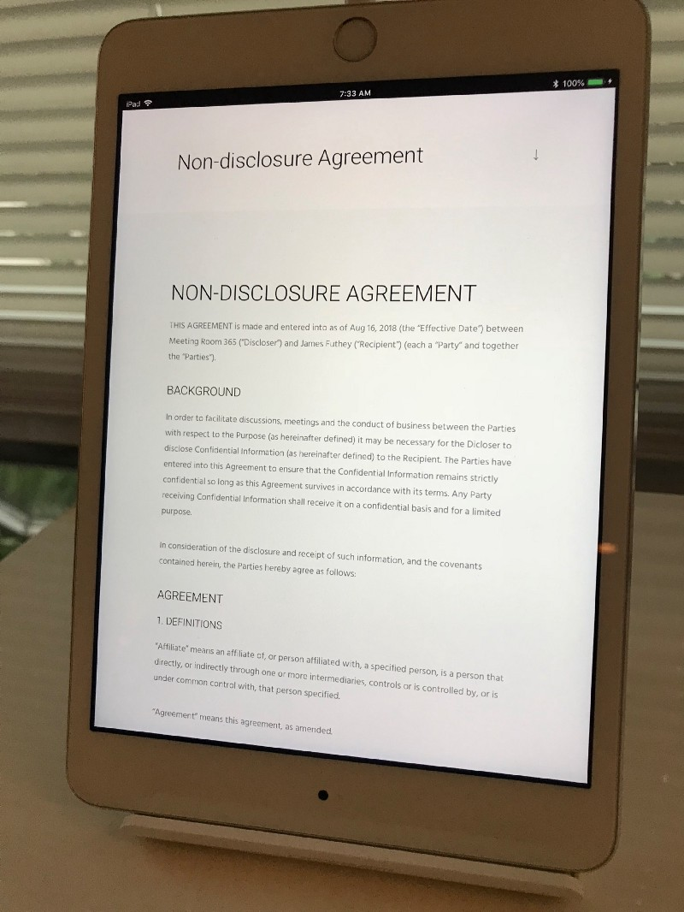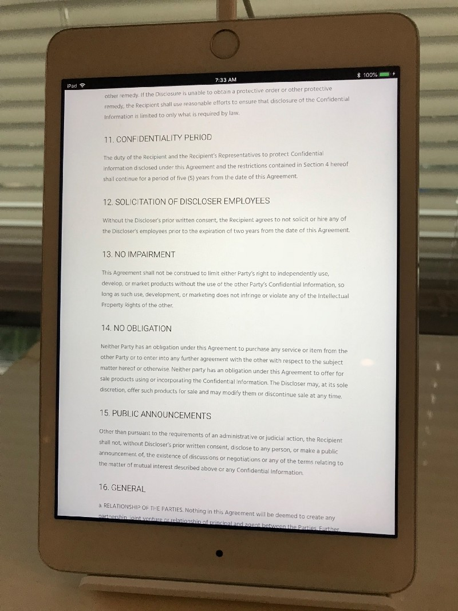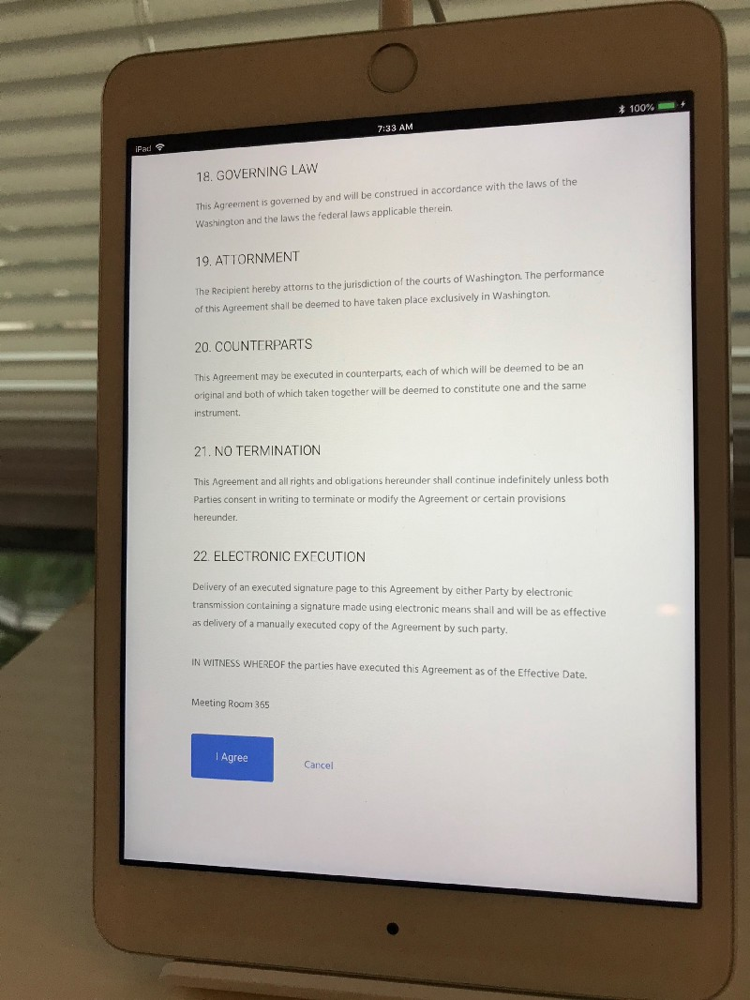

### Signature

The last step is the signature pad. Your guests will sign the NDA agreement with their finger. It’s as simple as using a modern Checkout Kiosk!

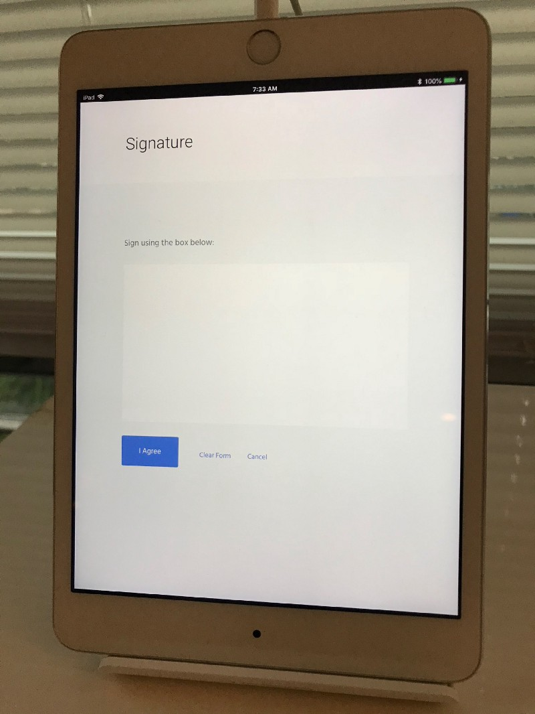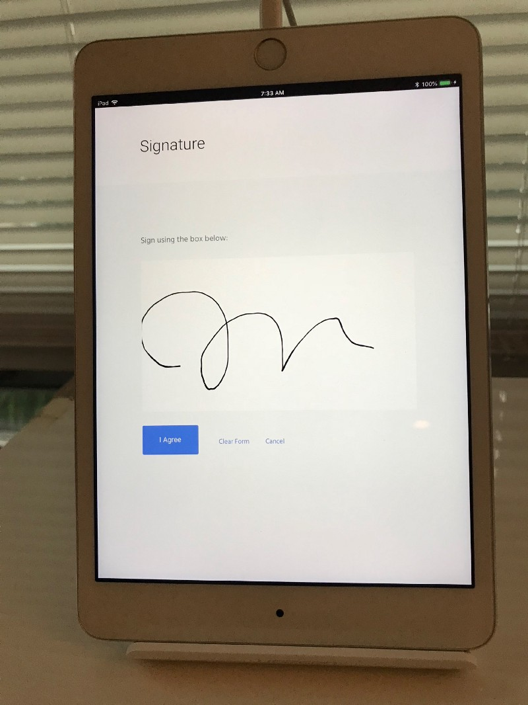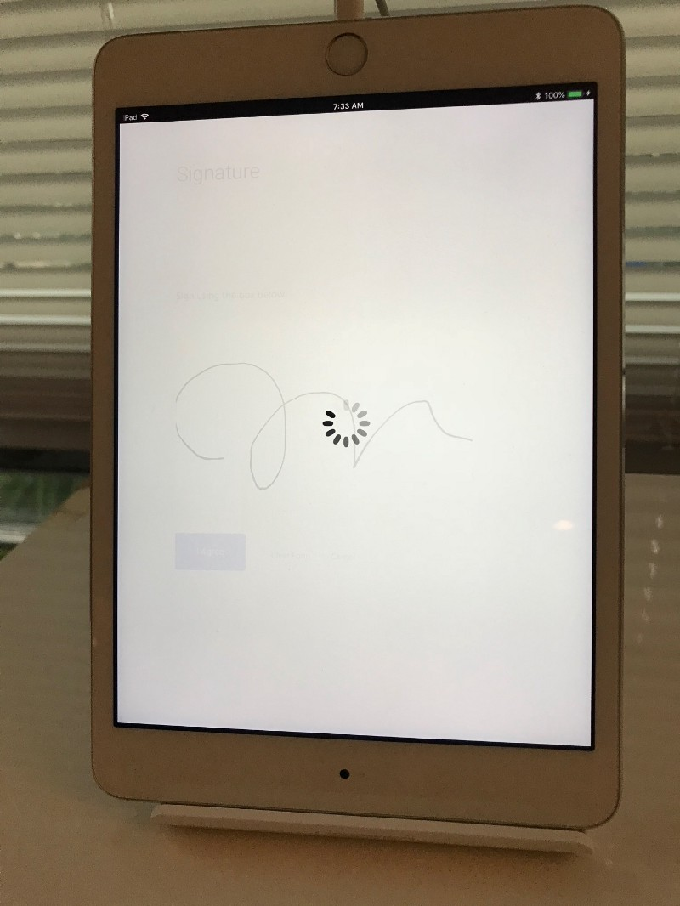

### Confirmation Screen & Notification Emails

Finally, your guests see a confirmation screen, and each party receives an email confirmation.

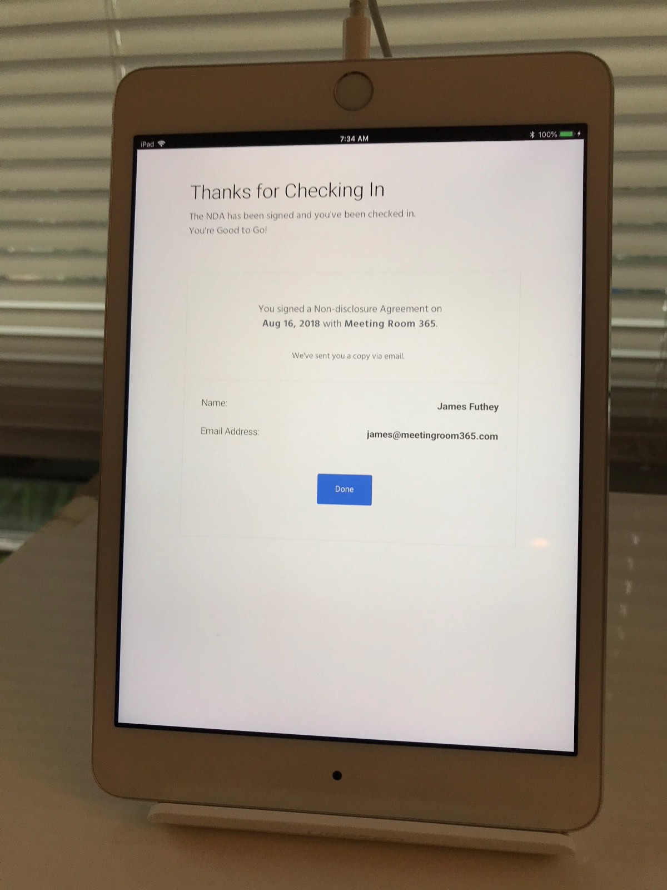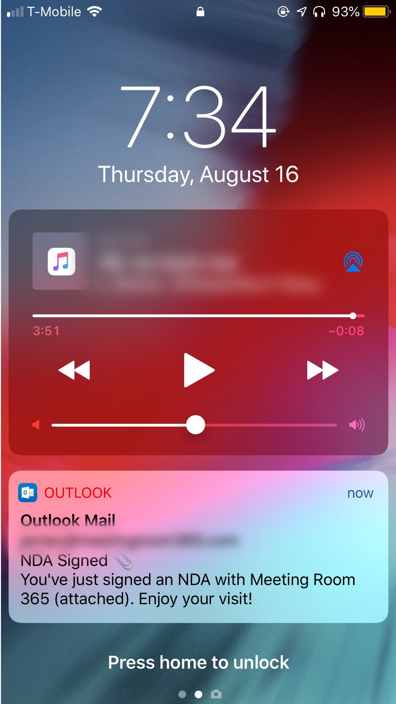

### Signed NDA Delivered via Email

Emails to your guests and employees are customizable, and contain the signed, legally-binding PDF (if applicable). Actual file size is ~500kb (not 6mb as pictured below).

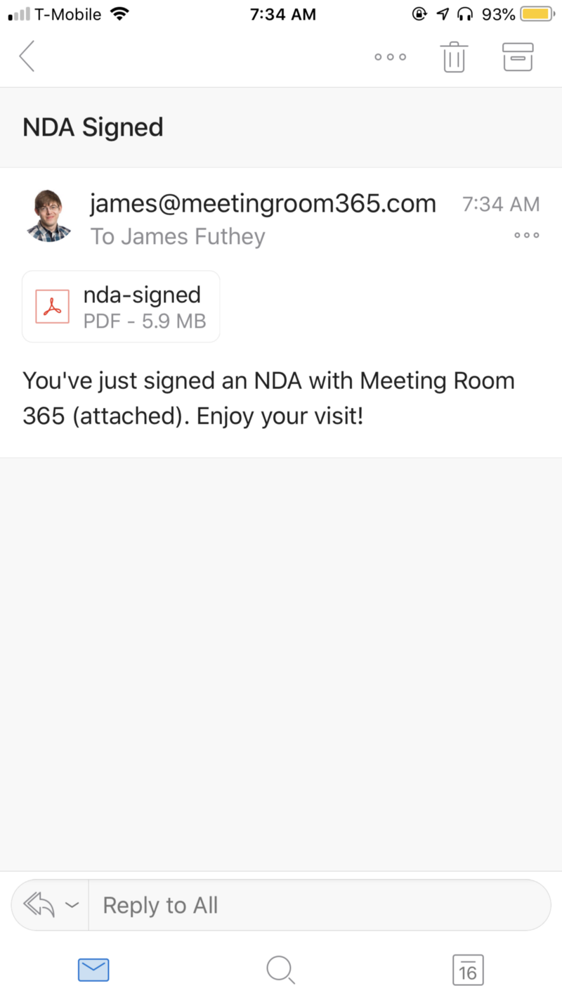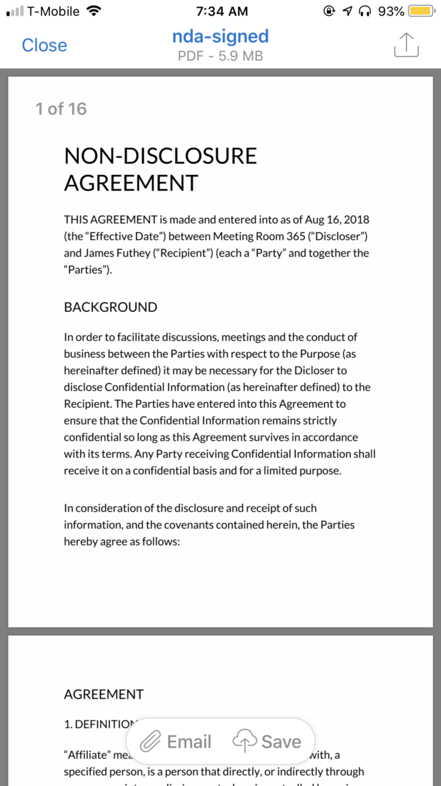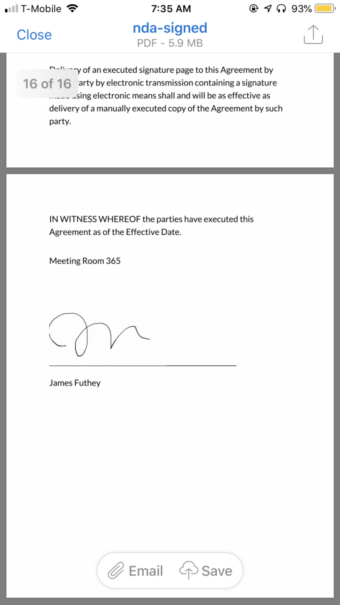

We also plan to add a few other simple features, such as **delivery paging & notifications**, an **“About Us”** page, and the ability for guests to send a message notifying your designated contact if they need assistance.

### Thanks for reading!