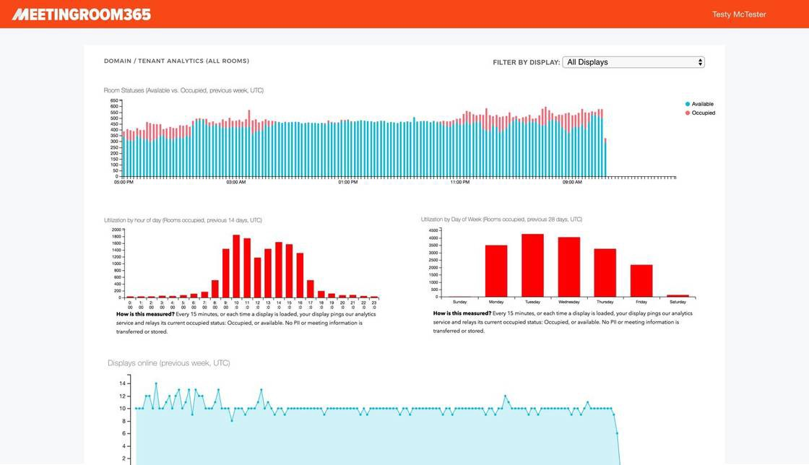

### We’ve added a new feature (Analytics)

Now, you can see uptime and utilization statistics for your rooms, from the Meeting Room 365 dashboard. Just select Analytics in the upper-right menu.

### Uptime

In the first chart, you can see the last seven days of uptime, to better understand outages and errors, and how often they occur.

### Room Availability

The next chart tracks seven days of room availability, to help understand patterns in room utilization.

### Room utilization by day of week and hour of day

The final two charts break-down utilization by hour of day and day of week, so you can better understand when your peak utilization times are, and how you can adjust bookings in your organization to more effectively utilize your space.

### Tracking utilization to determine if you need to create more meeting room space

If you realize that over the past quarter, your staff and managers are holding more meetings that you have space, it is time to look for more meeting space. Fortunately, if you integrate with Meeting Room 365, this utilization is easier to track than one might think.

Use analytics to understand when meetings are held most, and exactly what type of space that you need.

For example, take a close look at the time of day and days of week you reach 100% utilization. You can use this information to communicate to your office when “rush hour” occurs– and encourage managers to move recurring meetings outside of this period.

Another great use of analytics is to see which conference rooms are free– when employees feel like there aren’t enough rooms to go around. Often, it boils down to a communications issue, and an employee-all message can communicate which spaces might secretly be available, even during busy periods.

### Privacy

We put a great deal of effort into privacy when designing this feature, and do not store meeting data, at all.

We track all utilization using anonymous identifiers, to avoid the leakage of any data through third-party services.

Specifically, to support this feature, we store the following data in an analytics service:

-   An anonymous tenant identifier
-   An anonymous display identifier
-   Whether the display is online / offline
-   Whether the display is occupied / available
-   A Timestamp