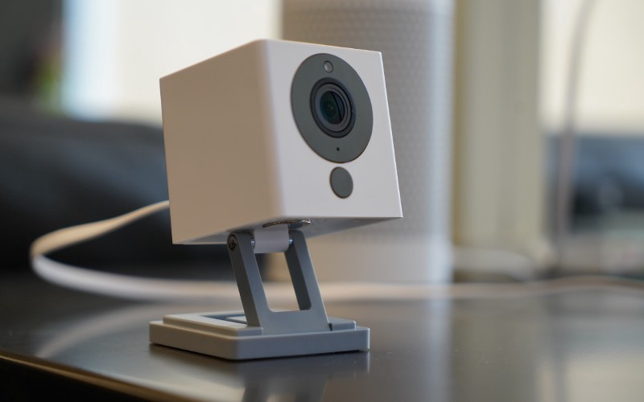
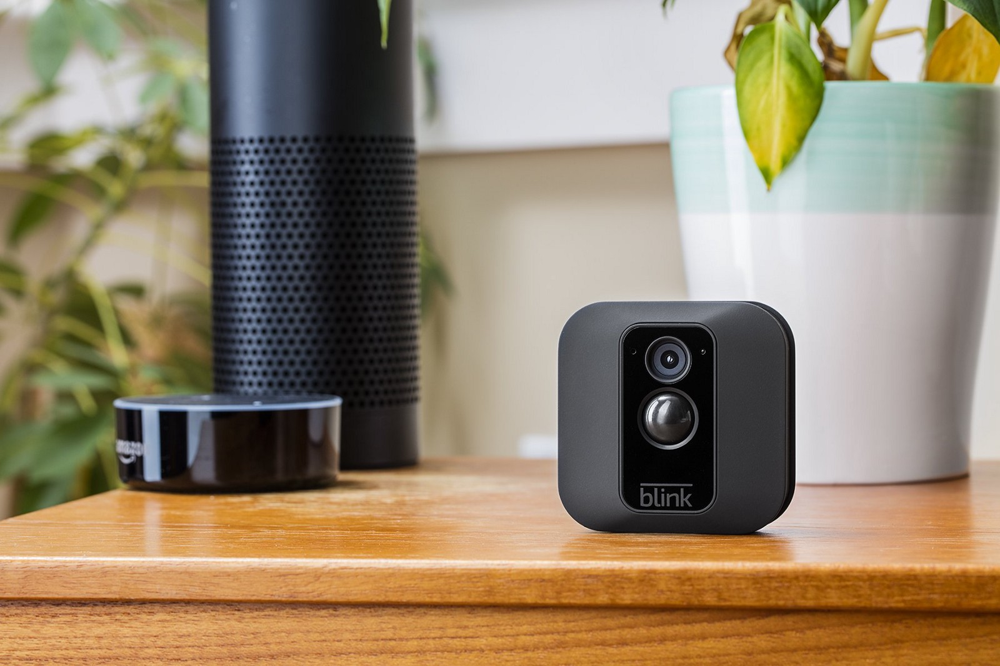
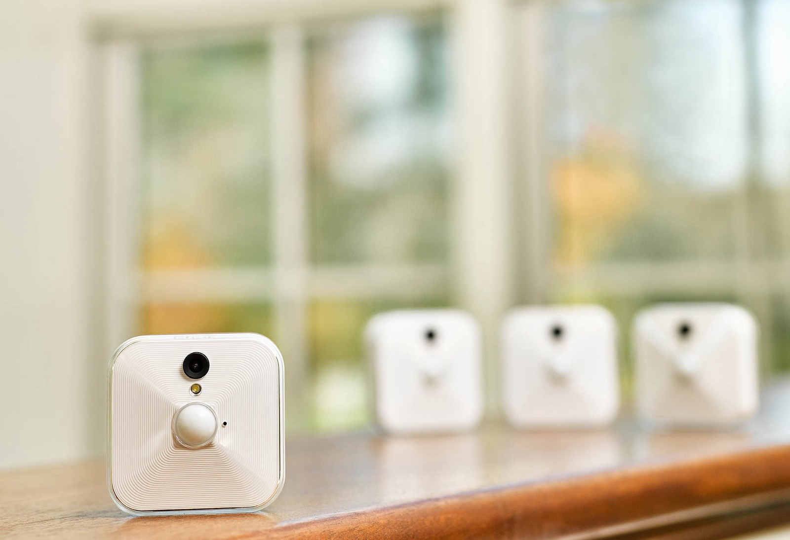
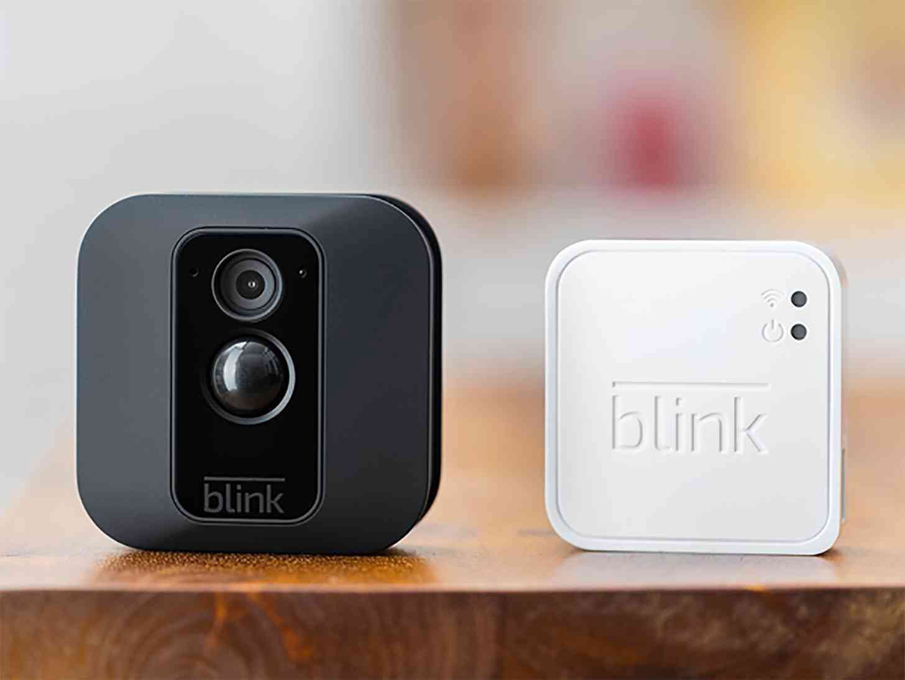

## We’ve integrated with IFTTT, for real-time presence detection, and more!

As many of you may know, the inexpensive and versatile [Wyze camera](https://www.wyze.com/) was created right here in Seattle, and is distributed by Amazon, where we’re located.

So, over the past year, we’ve experimented with various hardware products to enable **Presence Detection** in the Meeting Room 365 app. We even wrote an article about this [last year](https://medium.com/meeting-room-365/announcing-presence-detection-meeting-room-automation-with-blink-camera-integration-39fbe0b4dca6).

Today, we’ve enabled [IFTTT integration](http://support.meetingroom365.com/getting-started-guides/using-ifttt-to-add-presence-detection-hardware-to-meeting-room-displays), enabling [presence detection](http://support.meetingroom365.com/getting-started-guides/using-ifttt-to-add-presence-detection-hardware-to-meeting-room-displays) and [hardware triggers](http://support.meetingroom365.com/getting-started-guides/using-ifttt-to-trigger-a-hardware-action-based-on-meeting-room-status), for hundreds of IFTTT connected apps and thousands of hardware devices, which gives us the most robust hardware support of any competing platform.

We now support hundreds of IFTTT applets and thousands of device interactions!

This also supports the well-tested **Blink Camera** hardware, which we covered in the previous article.

### What can you do?

#### Force Check-ins, without the hassle

Want to enable a forced-check-in policy in your organization, and prevent meetings from cluttering up your calendars, when they never actually occur?

This technique is incredibly effective. But for your users, equally annoying. Mistakenly loosing your meeting room can be a frustrating experience.

Luckily, with Automatic check-ins, your users will never forget to check in to their meeting room. As long as they make it to their meetings on time, they won’t even realize they’re being forced to check in!

#### End Meetings Early, Every time

Ensure your Outlook calendars accurately reflect the current state of your room by enabling Presence Detection and automatically ending meetings early, when all of your participants have left the room.

#### Impromptu Reservations without a touch

If a room is available, presence detection gives you the ability to let users book a room just by walking into it. This is quickly reflected on Outlook calendars throughout the office. And when they leave, the room will revert back to being available in Outlook.

### See it in action!

To get started, you’ll need an IFTTT account.

Then, take a look at one of our [Getting Started Guides](http://support.meetingroom365.com/?q=ifttt) in the support center.

We provide examples for connecting devices which enable motion detection, and hardware which can be triggered based on the current status of your meeting room (for example, mounting a status light, and changing a Hue bulb to red when the room is occupied, and green when it is available).

---

**Thanks for reading!** Please reach out via the support channel if you have any questions.