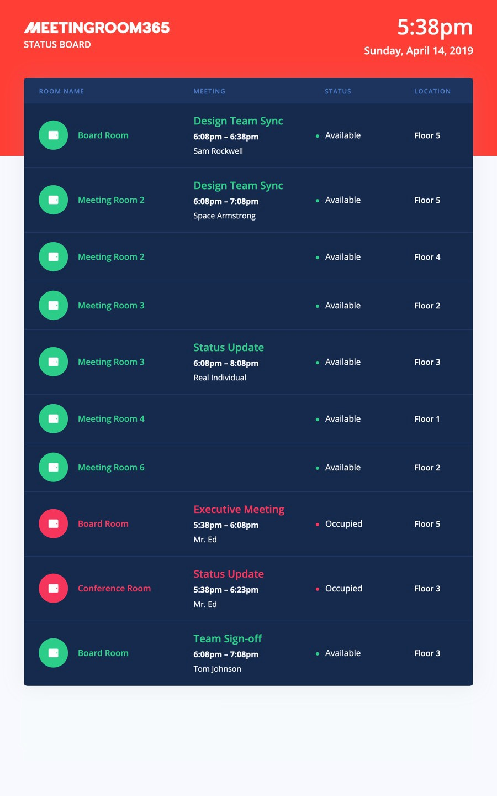
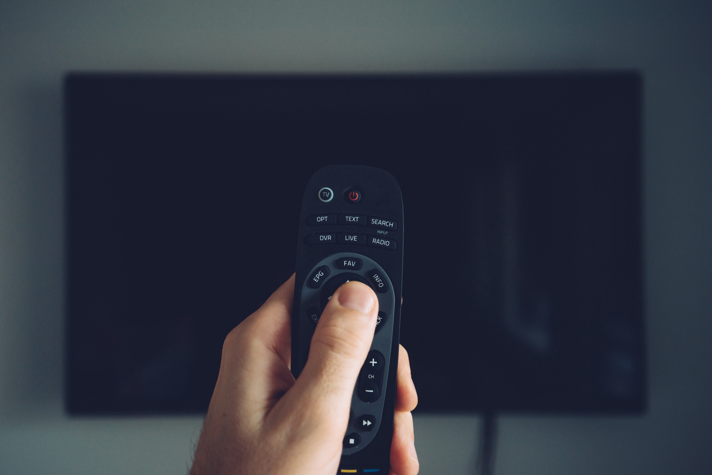
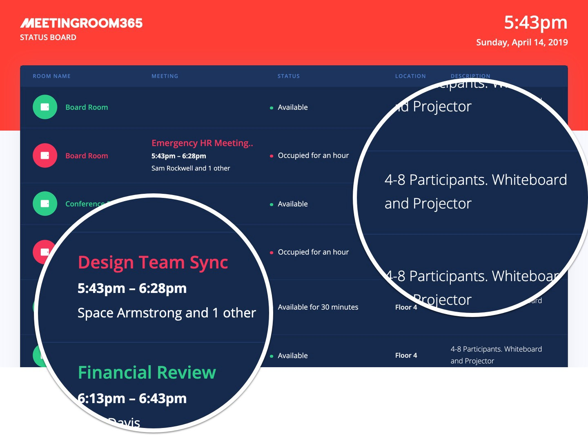

## One of our most requested features is live. Finally!

### Meeting Room Schedules on TVs!

Whether you’re in portrait or landscape, in 1080p or 4k, managing one TV or dozens, we want to become the [device management solution you depend upon for putting things on TVs](https://meetingroom365.com/status-board.html).

And, the first step toward getting there is…. [Meeting Room Schedules on TVs](https://meetingroom365.com/status-board.html)!

So, after a long beta period, we’ve re-released an easier-to-setup [status board display solution](https://meetingroom365.com/status-board.html) that you can plug into your existing [Meeting Room 365](https://meetingroom365.com/) deployment, and get started with right away.

**It features a number of long-requested features:**

-   Easier to set up (No service user accounts)
-   Handles large numbers of meetings more easily
-   Easy to customize and brand (No CSS required, but it’s there if you want to get fancy)
-   Internationalization / Localization
-   Whitelists & Blacklists
-   Groups & Filters
-   Easy to deploy & manage multiple status board displays

### Also: It’s Free

After long consideration, we’ve decided to make the status board free for now, or at least a year or so, while competitors charge $500 or more for a similar product.

#### What’s the catch?

We believe in pricing our product based on how much value we can provide to your organization. The closest proxy we have to that, is number of meeting room displays (and, this has become an industry standard).

And we believe status board displays (and other television-based displays) can provide a ton of value for your organization.

However, if we charged a lot for status board displays, you might not put in the effort to set up your first TV-based display. And you might not be able to give us the kind of feedback we need to make managing TV displays easier.

### What Hardware do you Currently Support?

Currently, we support about 75% of the hardware options available for DIY Digital Signage, Including:

-   **Chromecast / Chromecast Ultra** (Recommended)
-   **Chromebit** (Recommended)
-   Raspberry Pi (with some caveats)
-   FireTV (Beta)
-   Digital signage with a web browser

#### What we’re working on

-   Android TV native app
-   Better Fire TV Stick support

#### What we’re not working on

-   Apple TV (no browser support, AirPlay isn’t broadly supported)

### How do I get Started?

Getting started is easy! Just head to your [Meeting Room 365 Admin Portal](https://manage.meetingroom365.com/) and add a new status board display (it’s the TV icon under the plus icon, in the bottom left corner).

We’ve also set up a [second admin portal](https://admin.meetingroom365.com/) that manages Status Board displays and a couple of other beta products [here](https://admin.meetingroom365.com/) (which you may find easier to navigate).

Setup is pretty easy. Your meeting statuses are coming from your other displays, like the Room Finder. So, there’s no complicated setup process (you just customize your brand color, upload a (preferably white) logo, and customize the display name & location).

Then, you’ll get a unique URL you can use to set up your TV display.

#### Interested in Digital Signage on TVs?

### Let’s create something fun together!